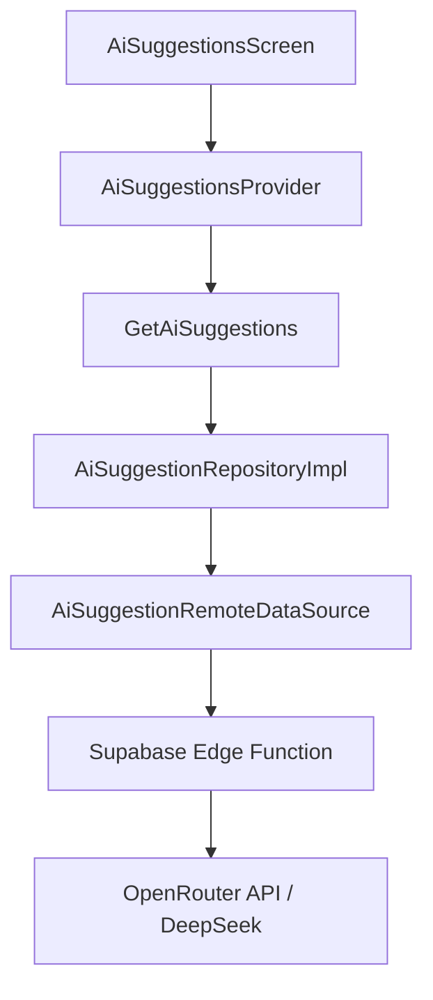

# AI Phase 1: Smart Shopping Suggestions

## Overview
Phase 1 introduces AI-powered shopping suggestions to SAWA. Users can enter natural language prompts (e.g., "I'm making pizza tonight") and receive a list of suggested items with quantities and categories.

## Architecture
The feature follows a **Feature-First Clean Architecture** layout:

## Privacy & Safety Rules
1. **Zero PII Leakage**: Requests to AI contain only: `prompt`, `homeType`, `listTitle`, `existingItems`, and `language`. No User IDs, Emails, or Auth Tokens are sent.
2. **No Auto-Addition**: AI suggestions are NEVER added automatically. Users must explicitly select items and confirm.
3. **Feature Flagging**: The feature is gated by `FeatureFlags.enableAi` (currently `false` by default in production).

## Data Boundary
| Field | Source | Description |
|-------|--------|-------------|
| `prompt` | User Input | Natural language request |
| `homeType` | Home Entity | e.g., "Family", "Bachelor", "Apartment" |
| `listTitle` | List Entity | Title of the current shopping list |
| `existingItems` | List Items | List of item names currently in the shopping list |
| `language` | User Settings | Current app language ('ar' or 'en') |

## Response Format
The AI returns a list of suggestions, each containing:
- `name`: Item name.
- `quantity`: Suggested amount (defaults to 1).
- `unit`: Measurement unit.
- `category`: Organization category.
- `reason`: A short explanation of why this item was suggested.

## Success Criteria
- [x] Context-aware suggestions (considers home type and existing items).
- [x] Bi-directional localization (Arabic and English).
- [x] Privacy compliance (no PII sent to AI).
- [x] High performance (debounced requests, loading states).

## Future Roadmap (Phase 2+)
- **Store Awareness**: Suggest items based on frequently visited stores.
- **Inventory Sync**: Don't suggest items the user already has in stock.
- **Personalized Habits**: Learn from past shopping history to refine suggestions.
