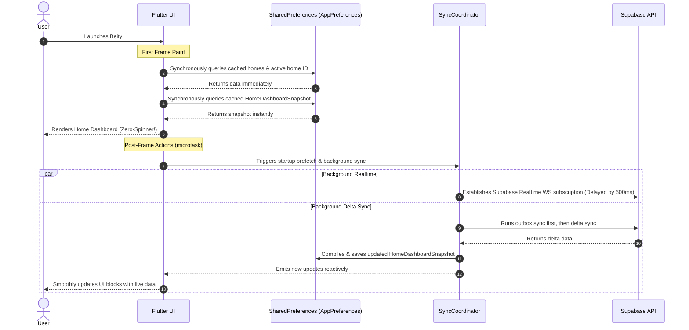

# WhatsApp-like Startup Strategy & Smart Resume Sync

This document describes the high-performance caching and background synchronization strategy implemented in Beity to achieve sub-second perceived load times (similar to WhatsApp) while maintaining a clean, reactive, local-first architecture.

---

## 1. Core Architecture Strategy

### Perceived Instant Startup (WhatsApp Philosophy)
To open the application immediately and present the user's last known state without any network blocks, we decoupled the UI paint cycles from external dependencies (Supabase, connection handshakes, WebSocket subscriptions). 



---

## 2. Technical Building Blocks

### A. Synchronous Caching Providers (`homes_provider.dart`)
Riverpod standard `FutureProvider`s or `StreamProvider`s inevitably begin in an `AsyncValue.loading()` state on startup, which defaults the UI to rendering a progress spinner. We introduced synchronous counterparts:
1. **`cachedUserHomesProvider`**: A synchronous `Provider` that reads the homes cache list directly from SharedPreferences on startup.
2. **`cachedActiveHomeIdProvider`**: A synchronous `Provider` that returns the active home ID instantly.
3. **`cachedActiveHomeProvider`**: Computes the matching `HomeModel` instantly from the cached list.

```dart
final cachedActiveHomeIdProvider = Provider<String?>((ref) {
  final userId = SupabaseService.currentUser?.id ?? 'anonymous';
  
  // 1. Watch the live StreamProvider so this synchronously updates
  final liveActiveHomeId = ref.watch(activeHomeIdProvider).valueOrNull;
  if (liveActiveHomeId != null) return liveActiveHomeId;

  // 2. Synchronous fallback for instant cold start
  try {
    final prefs = AppPreferences.instance;
    return prefs.getString('active_home_user:$userId');
  } catch (_) {
    return null;
  }
});
```

### B. Home Dashboard Snapshots (`HomeDashboardSnapshot`)
To prevent the dashboard from rendering empty cards or loading spinners for its primary modules (Active Shopping List, Recent Activities) while live queries are resolving, we store a compiled snapshot of the dashboard.
* **Reactive Background Updater**: When the live list, items, or activity providers change, `homeDashboardSnapshotUpdaterProvider` compiles a new `HomeDashboardSnapshot` and saves it to local preferences.
* **Instant Fallback**: If the live providers are in `loading` state, `HomeScreen` pulls from `cachedHomeDashboardSnapshotProvider` and renders the list name, items count, and last activity text instantly.

---

## 3. Smart Background Resume Sync Policy

To keep data fresh without overloading the database or degrading UI framerates when navigating back and forth, `SyncCoordinator` implements a smart, multi-tiered resume synchronization policy.

### Policy Rules
Upon app lifecycle transition to `resumed`, we inspect the duration elapsed since the last successful sync:

| Elapsed Duration | Tier | Action Performed |
| :--- | :--- | :--- |
| **< 30 seconds** | Skip | Do nothing. The data is considered fresh. |
| **30s – 5 minutes** | Light Sync | Runs Delta Sync for the **`shopping`** domain only. |
| **5m – 60 minutes** | Basic Sync | Runs Delta Sync for **`shopping`**, **`homes`**, and **`home_members`** domains. |
| **>= 60 minutes** | Full Sync | Runs a comprehensive background Delta Sync across all domains in parallel. |

### Priority Outbox Sync
If the device has pending outbox actions stored in the `Offline Queue`, `SyncCoordinator` prioritizes sending the outbox entries first before initiating a pull. This avoids server-side race conditions or stale delta queries.

---

## 4. Performance Tuning & WS Deferral

To maximize perceived launch speed, we postponed the initialization of the Supabase Realtime WebSocket subscription by **600 milliseconds** (`Future.delayed`).
* **Why?** Realtime subscriptions involve extensive TCP and TLS handshakes, presence handshakes, and event wire-up.
* **Result**: Competing CPU/Network resources are fully freed up during the critical startup frames, ensuring 60fps rendering of local data, while the socket connection is gracefully established after the UI settles.
