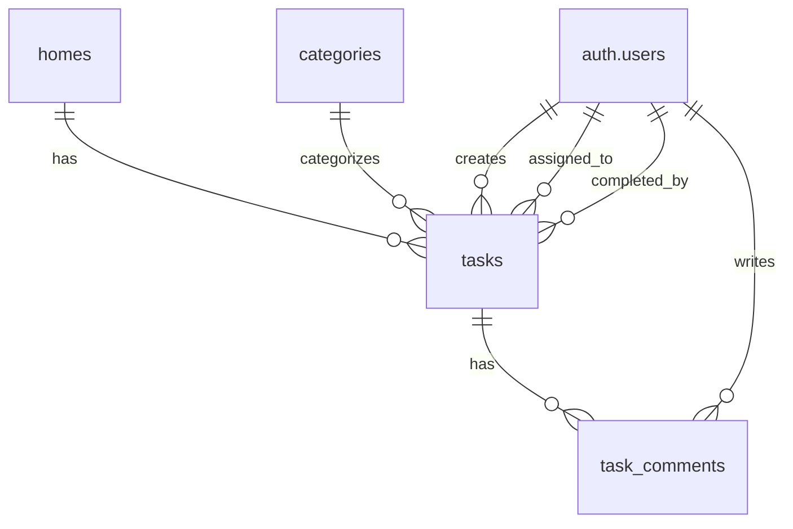

# Data Model: Tasks Phase

**Feature**: 015-tasks-phase
**Date**: 2026-05-13

## Entities

### tasks

Represents a household task or chore.

| Column | Type | Nullable | Default | Description |
|--------|------|----------|---------|-------------|
| id | uuid | no | gen_random_uuid() | Primary key |
| home_id | uuid | no | — | Foreign key to homes table |
| title | varchar(200) | no | — | Task title (capped at 200 chars) |
| description | text | yes | null | Task description (capped at 2000 chars) |
| due_date | date | yes | null | Optional due date |
| category_id | uuid | yes | null | Foreign key to categories table |
| assigned_to | uuid | yes | null | Foreign key to auth.users (null = unassigned) |
| status | varchar(20) | no | 'incomplete' | Status: incomplete or completed |
| recurrence_type | varchar(20) | yes | null | Recurrence: daily, weekly, monthly (null = non-recurring) |
| completed_by | uuid | yes | null | Foreign key to auth.users (who completed) |
| completed_at | timestamptz | yes | null | Completion timestamp |
| created_by | uuid | no | — | Foreign key to auth.users |
| created_at | timestamptz | no | now() | Creation timestamp |
| updated_at | timestamptz | no | now() | Last update timestamp |
| deleted_at | timestamptz | yes | null | Soft delete timestamp |
| archived_at | timestamptz | yes | null | Auto-archive timestamp (7 days after completion) |

**Constraints**:
- `title` length <= 200 characters
- `description` length <= 2000 characters
- `status IN ('incomplete', 'completed')`
- `recurrence_type IN ('daily', 'weekly', 'monthly')` or NULL

**Indexes**:
- `idx_tasks_home_id` on `home_id`
- `idx_tasks_assigned_to` on `assigned_to`
- `idx_tasks_status` on `status`
- `idx_tasks_due_date` on `due_date`
- `idx_tasks_category_id` on `category_id`
- `idx_tasks_created_by` on `created_by`
- `idx_tasks_active` on `home_id` (partial, WHERE deleted_at IS NULL AND archived_at IS NULL)

**RLS Policies**:
- SELECT: Home members only
- INSERT: Home members only
- UPDATE: Creator, assignee, or home admin (owner/admin role)
- DELETE: Soft delete only (set deleted_at)

---

### task_comments

Represents a message on a task.

| Column | Type | Nullable | Default | Description |
|--------|------|----------|---------|-------------|
| id | uuid | no | gen_random_uuid() | Primary key |
| task_id | uuid | no | — | Foreign key to tasks table |
| content | text | no | — | Comment content |
| created_by | uuid | no | — | Foreign key to auth.users |
| created_at | timestamptz | no | now() | Creation timestamp |

**Constraints**:
- `content` must not be empty

**Indexes**:
- `idx_task_comments_task_id` on `task_id`
- `idx_task_comments_created_at` on `created_at`

**RLS Policies**:
- SELECT: Home members only (via task's home_id)
- INSERT: Home members only
- UPDATE: Own comments only (created_by = auth.uid())
- DELETE: Own comments only (created_by = auth.uid())

---

## Relationships



---

## State Transitions

### Task Status
```
incomplete → completed (mark complete)
completed → incomplete (mark incomplete)
```

### Task Lifecycle
```
Active (incomplete) → Active (completed, < 7 days) → Archived (completed, >= 7 days)
Active → Deleted (manual soft-delete)
```

- **Active incomplete**: Visible in task list, can be edited/assigned/completed
- **Active completed**: Visible at bottom of task list for 7 days, can be marked incomplete
- **Archived**: Not visible in active list, accessible via "Archived" view
- **Deleted**: Not visible in any view, preserved for audit

### Recurrence Flow
```
Recurring task completed → New task created (same title, description, category, assignee, recurrence) → New due_date calculated
```

- Daily: new due_date = completion_date + 1 day
- Weekly: new due_date = completion_date + 7 days
- Monthly: new due_date = same calendar day next month (fallback to last day)
- If original has no due_date: new due_date = completion_date + interval
- Disabling recurrence: no new instances after current completion
